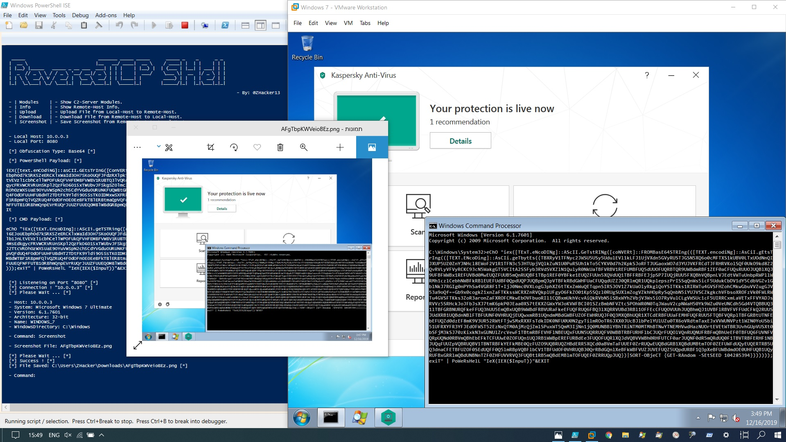

# ReverseTCP Shell

## Framework

```

  _____                           _______ _____ _____      _____ _    _      _ _ 
 |  __ \                         |__   __/ ____|  __ \    / ____| |  | |    | | |
 | |__) |_____   _____ _ __ ___  ___| | | |    | |__) |  | (___ | |__| | ___| | |
 |  _  // _ \ \ / / _ \ '__/ __|/ _ \ | | |    |  ___/    \___ \|  __  |/ _ \ | |
 | | \ \  __/\ V /  __/ |  \__ \  __/ | | |____| |        ____) | |  | |  __/ | |
 |_|  \_\___| \_/ \___|_|  |___/\___|_|  \_____|_|       |_____/|_|  |_|\___|_|_|
                                                     
                                                                                     - By: HACKER ALI 17                                                                                                           

 - | Modules    | - Show C2-Server Modules.
 - | Info       | - Show Remote-Host Info.
 - | Upload     | - Upload File from Local-Host to Remote-Host.
 - | Download   | - Download File from Remote-Host to Local-Host.
 - | Screenshot | - Save Screenshot from Remote-Host to Local-Host.

```

#Tool description

Hacking Windows with ReverseTCPShell, Bypass Firewall and 'No Virus Encryption' security software
      This tool is a PowerShell script that runs on Windows and creates the payload in 3 different ways it gives you the payload as code that you put in cmd and hack.


## PoC



## Contact

* facebook: [أكادمية تعلم البرمجة حتي الاحتراف
](https://www.facebook.com/Alloush.dz)
